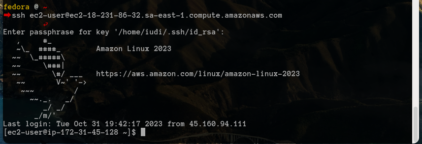

# Relatório do Projeto de Instância Segura em Nuvem

**UFSC - Universidade Federeal de Santa Catarina**
*Centro de Ciências, Tecnologias e Saúde* - *Departamento de Engenharia de Computação*

***DEC7128 -  Redes de Computadores II***

Professor: [*Gerson Luiz Camillo*](https://github.com/glcamillo)

Alunos:

*Iudi Zurba Melgarejo*

*Michele*

## Sumário

## Introdução

É de conhecimento comum que as práticas de segurança são indispensáveis para montagem de qualquer sistema computacional em rede.

Nesse trabalho, abordamos práticas mínimas de segurança, para montagem de um servidor web na nuvem, provendo serviços HTTP, HTTPS e SSH.

Esse é um relatório descritivo da experiência de montagem e configuração do servidor, e as práticas de segurança adotadas.

## 1. Provedor de Nuvem

Inicialmente, tentamos utilizar a Azure para realizar o trabalho, entretanto, enfrentamos dificuldades com a conta da microsoft na Azure, que estava deslogando automaticamente na criação da instância Linux.

Fomos então tentar usar o serviço da AWS e tudo ocorreu bem na criação da conta e da instância, portanto foi a escolhida para o trabalho, utilizando o *Free Tier*.

Iudi ficou como o responsável pela conta na AWS.(*root*)

## 2. MFA

*Responsável: Iudi*

Usuário root ativou a autenticação multifatorial, utilizando o Google Authenticator.

## 3. Grupos IAM

*Responsável: Iudi*

O usuário root criou dois grupos, um para os gerentes da EC2 e outro para o usuário "cebola".

1. **Grupo de Gerentes**

    O grupo de gerentes foi criado para que os usuários que o compõem possam realizar ações administrativas na instância, como instalar pacotes, criar usuários, etc.

    Política de permissões do grupo: `AmazonEC2FullAccess`

2. **Grupo Cebola**

    O grupo cebola foi criado para que o usuário "cebola", possa ver e ler as informações na instância, como ler arquivos de log, por exemplo.

    Política de permissões do grupo: `AmazonEC2ReadOnlyAccess`

## 4. Instância EC2

*Responsável: Iudi*

Tipo de instância: EC2 t2.micro

Imagem de SO escolhida: Amazon Linux 2023

Nome da instância: "Curupira"

Criamos a instância sem problemas, utilizamos as opções padrões do Free Tier para as configurações de armazenamento.

Foi gerada o par de chaves padrão da criação da instância.

## 5. SSH - Primeiras conexoes

*Responsável: Iudi*

Com o par de chaves criado automaticamente pelo AWS, foi feita a conexão com o servidor:

Foram adicionadas as chaves públicas dos integrantes no arquivo `authorized_keys` do servidor.

Feito isso, conexão com a chave ssh própria (iudi):

## 6. Usuários na instância

*Responsável: Iudi*

A equipe estava se conectando na instância com o usuário "ec2-user", que é o usuário padrão da instância.

É possível criar um usuário no sistema para cada integrante, e relacionar a respectiva chave pública em cada usuário criado.
Porém, optamos por manter um usuário único ec2-user, para manter a simplicidade no acesso e permissões no sistema.

## 7. Apache & HTTP

*Responsável: Iudi*

Montagem do servidor web com Apache e HTTP.

Instalação do Apache:

Seguindo o [Guia para instalação no Amazon Linux 2023](), instaladas as dependências e o Apache, bem como configuradas as permissões de acesso aos diretórios de `/var/www/html`.

* Serviço `httpd` iniciado e habilitado para iniciar com o sistema:

* PHP instalado e funcionando:

## 8. Restrições de portas na AWS

*Responsável: Iudi*

Inicialmente, deixamos as portas 80, 443 e 22 abertas para qualquer IP.

Posteriormente, a porta 80 foi restrita aos IPs da Rede UFSC.

## 9. Certificato SSL & HTTPS

*Responsável: Iudi*

* Geramos um certificado SSL auto assinado (nível mais básico de certificao)

## 9. Configuracoes de Firewall

*Responsável: Iudi*

* Permissão para a porta 80 liberada no firewall:

## 11. Instalando Honeypot

*Responsável: Iudi*

Instalamos a ferramenta Cowrie para realizar o serviço de honeypot na instância, escutando na porta 22 e 2222 por possiveis tentativas de acesso SSH.

O Cowrie simula um servidor SSH, e registra as tentativas de acesso, bem como as ações realizadas pelos atacantes. O conteudo e salvo em logs no usuario cowrie.

# 12. Reconfiguração da porta SSH

*Responsável: Iudi*

A porta para o servico SSH real foi alterada para uma porta especifica nao convencional, definidada pelo grupo.

* **Problema:** Inicialmente, cometi o deslize de nao alterar a porta do servico SSH antes de definir o encaminhamento da porta 22 para a 2222(onde o Honeypot esta escutando), isso acarretou com que o acesso por SSH a instancia fosse impossibilitado.

* **Solucao:** Apos certa pesquisa, consegui utilizar a funcionalidade da AWS chamada System Session Manager(SSM), que permite acesso a instancia sem a necessidade de uma porta aberta para SSH, e sem a necessidade de uma chave privada. Apenas com o usuario e senha do usuario ec2-user, e com o acesso ao console da AWS, foi possivel retomar acesso a instancia e corrigir a porta SSH.

## Configurar o NTP: sincronizar o relógio da instância com o horário de Brasília.

*Responsável: Michele*

Para configurar o NTP (Network Time Protocol) em uma instância da AWS com sistema CentOS/RHEL para sincronizar o relógio com o horário de Brasília usamos os seguintes comandos:

Como mostrado na imagem o pacote npn não foi reconhecido ou não está disponível nos repositórios de pacotes padrão da instância CentOS.
O que nos levou a pegar uma alternativa. A partir do CentOS 8, o NTP foi substituído pelo Chrony como o cliente NTP padrão. Portanto, utilizamos o Chrony para configurar a sincronização de tempo em vez do NTP. 

Como podemos ver na imagem abaixo, o sistema esta configurado para sincronizar o relógio da sua instância CentOS com o horário de Brasília usando servidores NTP.

## Acesso Mandatório (SELINUX): estrutura de segurança

*Responsável: Michele*

O SELinux, ou Security-Enhanced Linux, é uma estrutura de segurança desenvolvida para sistemas Linux que adiciona uma camada adicional de controle de acesso obrigatório (MAC - Mandatory Access Control) ao sistema operacional. Essa camada de segurança complementa o controle de acesso baseado em permissões tradicional, conhecido como controle de acesso discricionário (DAC - Discretionary Access Control), que é controlado pelos proprietários de arquivos e administradores do sistema.

- Enforcing (Impositivo): Neste modo, o SELinux está ativo e aplicará rigorosamente todas as políticas de segurança definidas, o que significa que ele restringirá o acesso a recursos do sistema de acordo com as políticas de controle de acesso obrigatório (MAC) configuradas. Se um processo tentar realizar uma ação que não esteja de acordo com as políticas, o SELinux negará essa ação.
  
O SELinux estará ativado e funcionando no modo "enforcing", o que aumentará a segurança do sistema, aplicando políticas de controle de acesso obrigatório. o SELinux pode ser rigoroso e pode exigir configurações adicionais para permitir que aplicativos específicos funcionem corretamente. Você pode consultar a documentação do SELinux e as políticas de segurança do CentOS ou RHEL para ajustar as configurações conforme necessário para as necessidades do seu sistema.

## Tecnicas de seguranca: CIS Benchmark

- **Desabilitar Portas Não Utilizadas**: Isso pode ajudar a prevenir acessos não autorizados a serviços que não são necessários para a operação da sua instância.

- **Configurar uma Política de Senhas Forte no IAM**: Isso inclui a aplicação de uma política de senhas complexas, uso de autenticação multifator (MFA), desabilitação do usuário root e rotação regular das chaves de acesso​​​​. https://aws.amazon.com/pt/what-is/cis-benchmarks/

## certificacao SSL: LetsEncrypt

## Logs

## LogsApache
